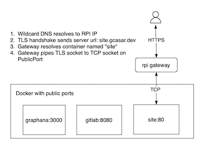

Exposes dockerized http servers using their name. Requires a wildcard certificate.

**This is a proof-of-concept.** No error handling. You can use other things to the same effect: nginx, traefik, ...



### Simple example
Expose a nginx demo under `https://test.your.domain`

```
docker run -d -p 8080:80 --name test ngnxdemos/hello
KEYPATH=/etc/letsencrypt/live/your.domain node gateway
```

The user MUST be able to bind to port 443 and access docker (`/var/run/docker.sock'`).

---

### Manually obtain a wildcard cert using letsencrypt

```
certbot certonly --manual --preferred-challenges=dns --email=<required> --agree-tos -d *.your.domain
```

After you add the TXT record and complete the challenge the key should be generated `/etc/letsencrypt/live/your.domain`.

This method requires **manual renewal** (every 90 days)!


### Next steps

- Remove the need for wildcard certificates (integrate with a DNS provider)
- Add support for headers (`X-Forwarded-For`, `X-Real-Ip`)
- Debug information (expose some prometheus metrics)
