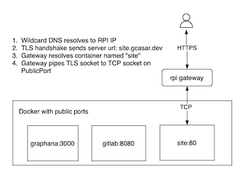

Exposes dockerized http servers using their name. Requires a wildcard certificate.

**This is a proof-of-concept.** No error handling. You can use other things to the same effect: nginx, traefik, ...

> **⚠️ Looking for a production-ready solution?** Check out the [**Traefik-based implementation**](README.traefik.md) with automatic SSL certificate management, Cloudflare integration, and CI/CD pipeline!



### Simple example
Expose a nginx demo under `https://test.your.domain`

```
docker run -d -p 8080:80 --name test ngnxdemos/hello
KEYPATH=/etc/letsencrypt/live/your.domain node gateway
```

The user MUST be able to bind to port 443 and access docker (`/var/run/docker.sock'`).

---

### Manually obtain a wildcard cert using letsencrypt

```
certbot certonly --manual --preferred-challenges=dns --email=<required> --agree-tos -d *.your.domain
```

After you add the TXT record and complete the challenge the key should be generated `/etc/letsencrypt/live/your.domain`.

This method requires **manual renewal** (every 90 days)!

---

## 🚀 Production-Ready Alternative

For production use, we recommend the **Traefik-based solution** which addresses all the limitations of this POC:

### ✨ Features
- ✅ **Automatic SSL Certificate Renewal** - No more manual renewals!
- ✅ **Cloudflare DNS-01 Challenge** - Wildcard certificates without manual DNS updates
- ✅ **Headers Support** - Automatic `X-Forwarded-For`, `X-Real-IP` injection
- ✅ **Prometheus Metrics** - Built-in monitoring and metrics
- ✅ **Dashboard** - Web UI for monitoring and configuration
- ✅ **Load Balancing** - Distribute traffic across multiple containers
- ✅ **Rate Limiting** - Protect against abuse
- ✅ **CI/CD Pipeline** - GitHub Actions for automated testing

### 📚 Documentation
- **[README.traefik.md](README.traefik.md)** - Complete setup guide
- **[MIGRATION.md](MIGRATION.md)** - How to migrate from this POC
- **[COMPARISON.md](COMPARISON.md)** - Detailed feature comparison
- **[examples/](examples/)** - Example configurations

### ⚡ Quick Start
```bash
# 1. Copy environment template
cp .env.example .env

# 2. Configure your domain and Cloudflare API token
nano .env

# 3. Run setup script
./setup-traefik.sh

# 4. Or start manually
docker-compose -f docker-compose.traefik.yml up -d
```

See [README.traefik.md](README.traefik.md) for full documentation.

---

## Original POC Implementation

The sections below describe the original Node.js proof-of-concept implementation.


### Original POC Next Steps (Addressed by Traefik Implementation)

- ~~Remove the need for wildcard certificates (integrate with a DNS provider)~~ ✅ Done with Traefik + Cloudflare
- ~~Add support for headers (`X-Forwarded-For`, `X-Real-Ip`)~~ ✅ Done with Traefik
- ~~Debug information (expose some prometheus metrics)~~ ✅ Done with Traefik

See [README.traefik.md](README.traefik.md) for the production-ready implementation.
